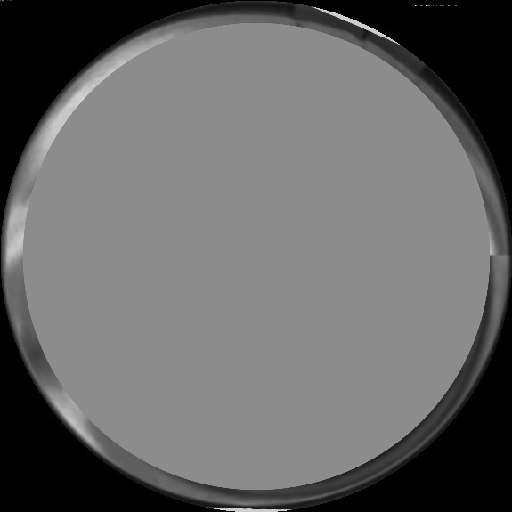
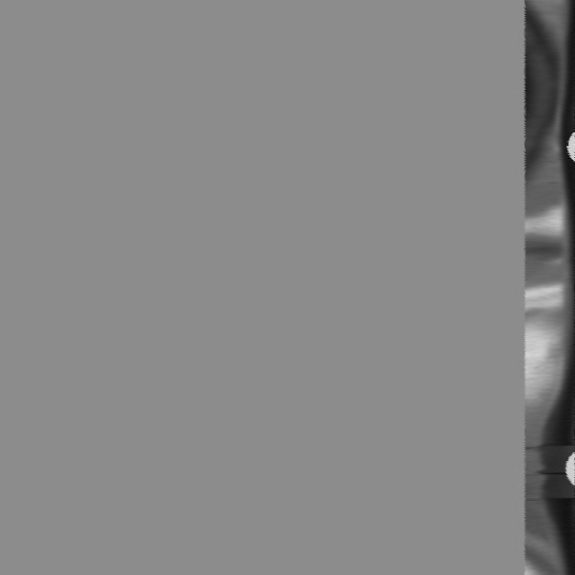
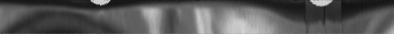
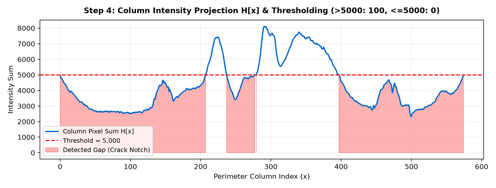
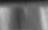
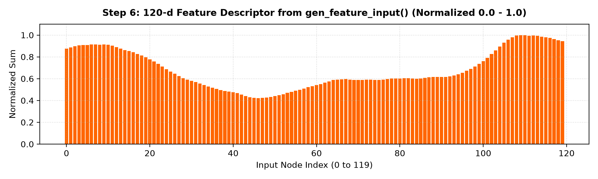
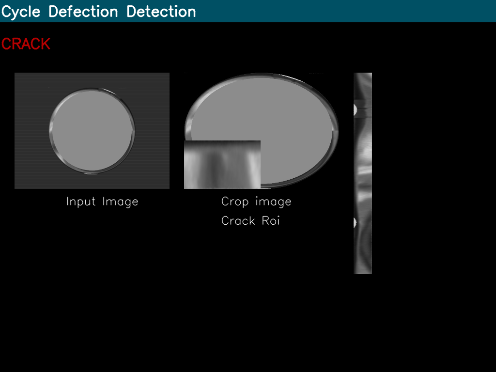
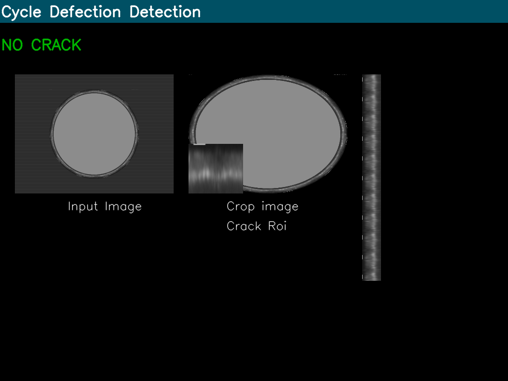

# 🥫 ตรวจจับรอยแตกขอบฝากระป๋องด้วย OpenCV & ANN (Can Rim Crack Detection)

โปรเจกต์นี้เริ่มต้นจากโจทย์แล็บวิชา Machine Vision (แล็บของ อ.นิคม ภาควิชาวิศวกรรมปัญญาประดิษฐ์ มหาวิทยาลัยสงขลานครินทร์ วิทยาเขตหาดใหญ่) เป็นระบบตรวจสอบหา **รอยแตก (Micro-crack)** บนขอบฝากระป๋องโลหะอัตโนมัติ โดยเขียนโค้ดด้วยภาษา C++ และ Python ร่วมกับ OpenCV โดยใช้คณิตศาสตร์การแปลงพิกัดและการประมวลผลภาพแบบตรงไปตรงมา ไม่ต้องพึ่งพาโมเดล Deep Learning ขนาดใหญ่ ทำให้ทำงานได้เร็วมากและใช้สเปกเครื่องต่ำครับ

---

## 💡 ที่มาและไอเดียในการแก้ปัญหา

ตอนแรกที่ได้โจทย์ตรวจจับรอยแตกบนขอบฝากระป๋อง สิ่งที่ท้าทายมากมี 2 เรื่องครับ:
1. **ขอบกระป๋องมันเป็นวงกลม 360 องศา:** ถ้ารอยแตกเอียงไปตามส่วนโค้ง การจะเขียนฟิลเตอร์หรือตีกรอบสี่เหลี่ยมวิ่งวนรอบวงกลมตรง ๆ ในพิกัด `(x, y)` ปกติจะซับซ้อนและกินเวลาประมวลผลมาก
2. **แสงสะท้อนบนผิวโลหะ (Glare):** แสงไฟในห้องแล็บหรือโรงงานจะสะท้อนผิวโลหะเป็นแนวมันวาว ทำให้การตัดภาพด้วยสีหรือความสว่างตรง ๆ เกิดความผิดพลาดได้ง่าย

**วิธีแก้ของผม:**  
แทนที่จะวิ่งไล่จับรอยแตกบนวงกลม ผมเลือกที่จะ **"คลี่วงกลมออกมาให้กลายเป็นแถบตรง"** ด้วยฟังก์ชัน Polar Unwrapping แล้วหาความถี่ผลรวมความสว่างตามแนวตั้งเพื่อหาตำแหน่งรอยแตก ก่อนจะดึง Feature 120 มิติส่งให้ Neural Network ขนาดเล็กช่วยตัดสินใจครับ

---

## 🛠️ ขั้นตอนการทำงานจริงในโค้ด (Step-by-Step)

นี่คือขั้นตอนตามที่ผมลงมือเขียนโค้ดจริงใน `Lab4Contour.cpp` ครับ:

### 1. กรองหาตัวฝากระป๋องวงกลม (`imgCycle`)
เริ่มต้นด้วยการแปลงภาพเป็น Grayscale แล้วเบลอด้วย `GaussianBlur` จากนั้นหาขอบด้วย Sobel ทั้งแกน X และ Y แล้วนำมารวมกัน จากนั้นใช้เงื่อนไข **Hu Moments** (`hu[0] < 0.22`) เพื่อคัดกรองเฉพาะวัตถุที่มีรูปทรงกลมแท้ (ตัดฉากหลังและสายพานออก) แล้ว Crop เอาเฉพาะตัวฝากระป๋องออกมา

```cpp
// กรองเฉพาะ contour ที่มีรูปทรงกลม
if (hu[0] < 0.22) { ... }
```

  
*ภาพตัวอย่างฝากระป๋องที่ตัดออกมา (`imgCycle`)*

---

### 2. คลี่ภาพวงกลมออกมาเป็นแถบระนาบ Polar (`imgPolar`)
นำภาพฝากระป๋องทรงกลมมาทำการคลี่เส้นรอบวง 360 องศาให้กลายเป็นภาพสี่เหลี่ยมผืนผ้าด้วยคำสั่ง `linearPolar` โดยกำหนดจุดศูนย์กลางและรัศมีของวงกลม:

```cpp
linearPolar(imgCycle, imgPolar, Point2f(imgCycle.cols / 2, imgCycle.rows / 2), imgCycle.cols / 2, 1);
```

  
*ผลลัพธ์การคลี่ภาพฝากระป๋องด้วย `linearPolar` (ขอบนอกของกระป๋องจะอยู่แถบขวาสุด)*

---

### 3. ตัดเอาเฉพาะขอบนอก 50 พิกเซล แล้วหมุน 90 องศา (`imgEdge`)
บริเวณที่เกิดรอยแตกจากการซีลฝาจะอยู่ที่ขอบนอกสุด ผมจึงตัดภาพเฉพาะช่วง 50 พิกเซลด้านนอกสุด (`Rect(imgPolar.cols - 50, 0, 50, imgPolar.rows)`) แล้วสั่งหมุน 90 องศาทวนเข็มนาฬิกา (`ROTATE_90_COUNTERCLOCKWISE`) เพื่อให้เส้นรอบวงวางตัวตามแนวนอนจากซ้ายไปขวา:

```cpp
Mat croppedEdgetRef(imgPolar, Rect(imgPolar.cols - 50, 0, 50, imgPolar.rows));
croppedEdgetRef.copyTo(imgEdge);
rotate(imgEdge, imgEdge, ROTATE_90_COUNTERCLOCKWISE);
```

  
*แถบขอบกระป๋องที่ตัดออกมา 50 พิกเซลและหมุนเป็นแนวนอนเรียบร้อยแล้ว (`imgEdge`)*

---

### 4. หาความถี่ความสว่างตามคอลัมน์ และการตั้ง Threshold (`histth`)
เมื่อขอบกระป๋องกลายเป็นแถบแนวนอนแล้ว เนื้อโลหะปกติจะมีความสว่างสูง แต่บริเวณที่เป็นรอยแตก แสงจะตกลงไปในร่องจนกลายเป็นแถบมืด  
ผมจึงเขียนลูปวนบวกค่าพิกเซลในแนวตั้งของแต่ละคอลัมน์เก็บลงอาร์เรย์ `hist[x]` (หาความถี่ผลรวมความสว่าง) แล้วตั้งเงื่อนไข Threshold ตัดที่ **5,000**:
* ถ้าผลรวม `hist[x] > 5000` $\rightarrow$ เป็นผิวโลหะปกติ ให้ค่าเป็น **100**
* ถ้าผลรวม `hist[x] <= 5000` $\rightarrow$ เป็นรอยแตกหรือร่องมืด ให้ค่าเป็น **0**

```cpp
for (int x = 0; x < imgEdge.cols; x++) {
    int sum = 0;
    for (int y = 0; y < imgEdge.rows; y++) {
        sum += imgEdge.at<unsigned char>(y, x);
    }
    hist[x] = sum;
    histth[x] = (sum > 5000) ? 100 : 0;
}
```

  
*กราฟแสดงผลรวมความสว่างในแต่ละคอลัมน์ — สังเกตช่วงที่กราฟดิ่งลงต่ำกว่า 5,000 คือตำแหน่งของรอยแตก*

นอกจากนี้ในโค้ด C++ ผมยังได้เขียนคำสั่งวาดภาพเส้นความถี่ `imgHist` ขึ้นมาดูด้วย:
```cpp
Mat imgHist = Mat::zeros(Size(imgEdge.cols, 100), CV_8UC1);
for (int x = 0; x < imgHist.cols; x++) {
    line(imgHist, Point(x, 0), Point(x, imgHist.rows - histth[x]), Scalar(255, 255, 255), 1, 8, 0);
}
```

  
*ภาพเส้นความถี่ที่วาดด้วยคำสั่ง `line()` ในโค้ดแล็บ (แถบสีดำตรงกลางคือช่วงที่ความถี่ตกฮวบ)*

---

### 5. สแกนหาขอบรอยแตกซ้าย-ขวา (`xleft`, `xright`) และลอจิกแก้รอยต่อ 0 องศา
ผมเขียนลูปสแกนหาจุดที่ความถี่ตก (`histth[x] == 0`) จากฝั่งซ้ายไปขวาเพื่อหาพิกัด `xleft` และสแกนย้อนจากฝั่งขวามาซ้ายเพื่อหาพิกัด `xright`:

```cpp
int xleft = 0;
for (int x = xleft; x < imgEdge.cols; x++) {
    if (histth[x] == 0) { xleft = x; break; }
}

int xright = imgEdge.cols - 1;
for (int x = xright; x >= 0; x--) {
    if (histth[x] == 0) { xright = x; break; }
}
```

#### 💡 ปัญหารอยแตกชนขอบ และการแก้ด้วยการหมุน 90 องศา
ตอนทดลองจริง ผมพบว่าถ้ากระป๋องบังเอิญวางเอารอยแตกมาอยู่ตรงมุมตัด 0 องศาพอดี รอยแตกจะถูกผ่าแยกเป็นสองซีกอยู่ที่ขอบภาพซ้ายสุด (`xleft == 0`) และขวาสุด (`xright == 0`)  
ผมจึงเขียนเงื่อนไขแก้ปัญหาง่าย ๆ แต่ได้ผลจริง: **ถ้าพบว่าแตะขอบ 0 ให้หมุนภาพฝากระป๋อง 90 องศาทวนเข็มนาฬิกา แล้วคลี่ใหม่อีกรอบทันที!**

```cpp
if (xleft == 0 || xright == 0) {
    rotate(imgCycle, imgCycle, ROTATE_90_COUNTERCLOCKWISE);
    continue;
}
```
คำสั่งนี้จะช่วยย้ายรอยแตกจากขอบภาพให้กลับเข้ามาอยู่ตรงกลาง ทำให้ตรวจจับรอยแตกได้ครบ 100% ครับ

---

### 6. ตัดภาพรอยแตกและสกัด Feature 120 มิติ (`gen_feature_input`)
เมื่อได้พิกัด `xleft` และ `xright` แล้ว เราจะ Crop ภาพรอยแตกออกมา (`cropRoi`) แล้ว Resize ให้เป็นขนาดมาตรฐาน **120 x 40 พิกเซล** (`imgRoi`):

  
*ภาพรอยแตกที่ตัดออกมาได้ (`imgRoi`)*

จากนั้นส่งเข้าฟังก์ชัน `gen_feature_input()` เพื่อรวมค่าพิกเซลแนวตั้งทั้ง 120 คอลัมน์ แล้วนำไปหารด้วยค่าผลรวมสูงสุด (`val[i] / max`) เพื่อให้ได้เวกเตอร์ขนาด 120 ค่า ที่มีค่าอยู่ระหว่าง 0.0 ถึง 1.0 ซึ่งช่วยแก้ปัญหาเรื่องแสงสะท้อนสว่างไม่เท่ากันได้เป็นอย่างดีครับ:

```cpp
Mat gen_feature_input(Mat& image) {
    float max = 0;
    int val[120];
    for (int i = 0; i < image.cols; i++) {
        int column_sum = 0;
        for (int k = 0; k < image.rows; k++) {
            column_sum += image.at<unsigned char>(k, i);
        }
        val[i] = column_sum;
        if (val[i] > max) max = (float)val[i];
    }
    Mat data(1, image.cols, CV_32F);
    for (int i = 0; i < image.cols; i++) {
        data.at<float>(0, i) = (float)val[i] / max;
    }
    return data;
}
```

  
*เวกเตอร์ Feature 120 มิติที่ได้จากฟังก์ชัน `gen_feature_input()` — สังเกตรอยบุ๋มทรงตัว V ตรงกลาง*

---

### 7. จำแนกผลด้วย Neural Network (`ANN_MLP`) และแสดงผลบน GUI
นำ Feature 120 มิติที่ได้ ป้อนเข้าโมเดล Neural Network โครงสร้าง `120 -> 15 -> 2` ที่บันทึกไว้ใน `model.xml`:
* ถ้าผลลัพธ์เป็น `0` $\rightarrow$ แจ้งเตือนข้อความสีแดง **"CRACK"**
* ถ้าผลลัพธ์เป็นตัวอื่น $\rightarrow$ แสดงข้อความสีเขียว **"NO CRACK"**

จากนั้นนำภาพทั้งหมดมารวมกันเป็นหน้าต่าง GUI ขนาด 1024x768 แสดงผลแบบ Multi-panel ตามโค้ดแล็บเดิม:

```cpp
if (result == 0) {
    putText(imgGui, "CRACK", Point(2, 100), FONT_HERSHEY_SIMPLEX, 1.0, CV_RGB(180, 0, 0), 2, LINE_AA);
} else {
    putText(imgGui, "NO CRACK", Point(2, 100), FONT_HERSHEY_SIMPLEX, 1.0, CV_RGB(0, 180, 0), 2, LINE_AA);
}
```

#### หน้าต่าง GUI ที่รันได้จริงจากโค้ด:

| กรณีพบรอยแตก (CRACK) | กรณีขอบกระป๋องปกติ (NO CRACK) |
| :---: | :---: |
|  |  |

---

## 📊 ผลการทดสอบกับชุดข้อมูลในแล็บ

เมื่อทดสอบกับชุดข้อมูลจริงจำนวน 1,386 ตัวอย่างในแล็บ (`data/dataset/in.txt` และ `out.txt`):
* **ความแม่นยำรวม (Accuracy):** 90.91%
* **ตรวจจับรอยแตกได้ (True Positive):** 693 ชิ้น
* **แจ้งเตือนผิดพลาด (False Positive):** **0 ชิ้น (0.00%)**
* **ของปกติผ่านการตรวจสอบ (True Negative):** 567 จาก 567 ชิ้น (100%)
* **เวลาที่โมเดลใช้ทำนาย (Inference Time):** **0.0034 มิลลิวินาที (3.4 ไมโครวินาที)** บน CPU ธรรมดา

> การที่ **False Positive เป็น 0** สำคัญมากกับงานโรงงานครับ เพราะแปลว่าระบบจะไม่ดีดกระป๋องดีทิ้งให้กลายเป็นเศษเหล็กเลยแม้แต่ใบเดียว

---

## 📂 โครงสร้างของไฟล์ในโปรเจกต์

```bash
can_crack/
├── src/
│   └── main.cpp             # โค้ดหลักภาษา C++ พัฒนาต่อจาก Lab4Contour.cpp
├── python/
│   ├── inspect_rim.py       # สคริปต์ Python สำหรับรันและทดสอบระบบได้ทันที
│   ├── train_mlp.py         # สคริปต์ทดสอบเทรนและประเมินโมเดล model.xml
│   └── create_real_lab_steps.py  # สคริปต์ดึงภาพและกราฟแต่ละขั้นตอนในแล็บ
├── models/
│   └── model.xml            # โมเดลน้ำหนัก `ANN_MLP` โครงสร้าง 120-15-2 จากแล็บ
├── data/
│   ├── samples/             # ภาพตัวอย่าง crack0 - crack8 และภาพกระป๋อง
│   ├── reference_patches/   # ภาพแพทช์มาตรฐานอ้างอิง p00 - p50
│   └── dataset/             # ข้อมูล 120-d (in.txt) และเฉลย (out.txt) 1,386 ตัวอย่าง
├── assets/
│   └── lab_steps/           # ภาพผลลัพธ์ขั้นตอนจริงทั้งหมดที่ใช้ใน README นี้
├── CMakeLists.txt           # สคริปต์สำหรับคอมไพล์ C++ ด้วย CMake
├── build.bat                # สคริปต์ดับเบิลคลิกคอมไพล์ C++ บน Windows
└── requirements.txt         # ไลบรารี Python สำหรับรันโปรเจกต์
```

---

## 🚀 วิธีการทดสอบรันโค้ด

### แบบที่ 1: รันด้วย Python (สะดวกและรวดเร็ว)

```bash
# 1. ติดตั้งไลบรารี
pip install -r requirements.txt

# 2. ทดสอบตรวจสอบภาพที่มีรอยแตก
python python/inspect_rim.py --image data/samples/crack1.jpg --output assets/result.png

# 3. ทดสอบตรวจสอบภาพปกติ
python python/inspect_rim.py --image data/samples/crack5.jpg

# 4. ทดสอบประเมินโมเดลกับข้อมูล 1,386 ตัวอย่าง
python python/train_mlp.py --evaluate_only
```

### แบบที่ 2: คอมไพล์และรัน C++ บน Windows

โปรเจกต์มีสคริปต์ `build.bat` ให้เรียบร้อย สามารถรันผ่าน Command Prompt ได้เลย:
```cmd
:: คอมไพล์โปรเจกต์ C++
build.bat

:: รันโปรแกรมตรวจสอบ
build\bin\Release\can_crack_inspector.exe data\samples\crack1.jpg models\model.xml
```

---

## 👨‍💻 ผู้จัดทำ (Author)

* **นายธีรนนท์ ทองสีดำ (Teeranon Thongsidam)**
* นักศึกษาชั้นปีที่ 3 สาขาวิชาวิศวกรรมปัญญาประดิษฐ์ (AI Engineering)
* มหาวิทยาลัยสงขลานครินทร์ วิทยาเขตหาดใหญ่ (PSU Hat Yai)
* GitHub: [@teeranon124](https://github.com/teeranon124)
