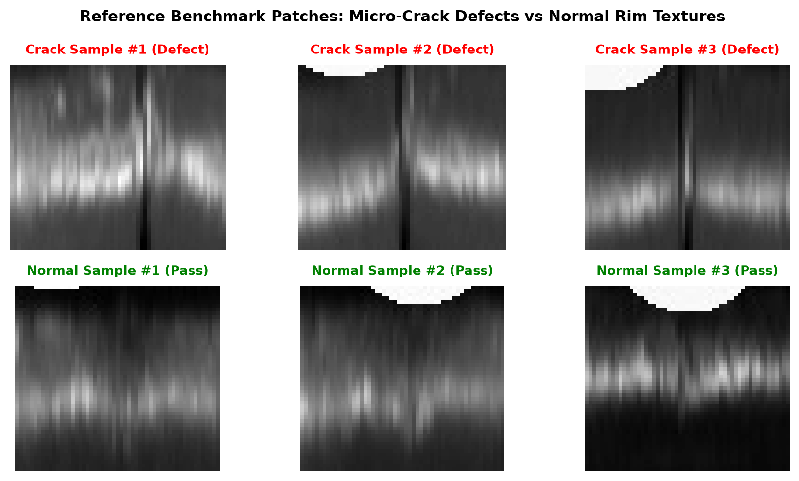
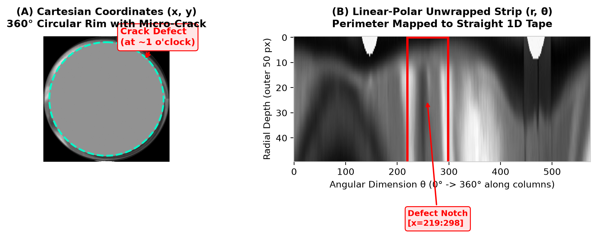
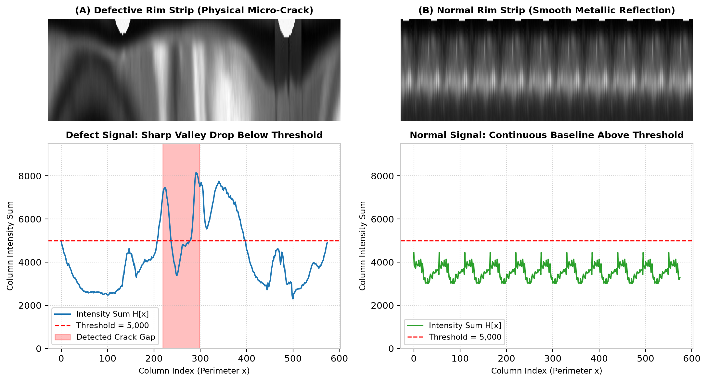
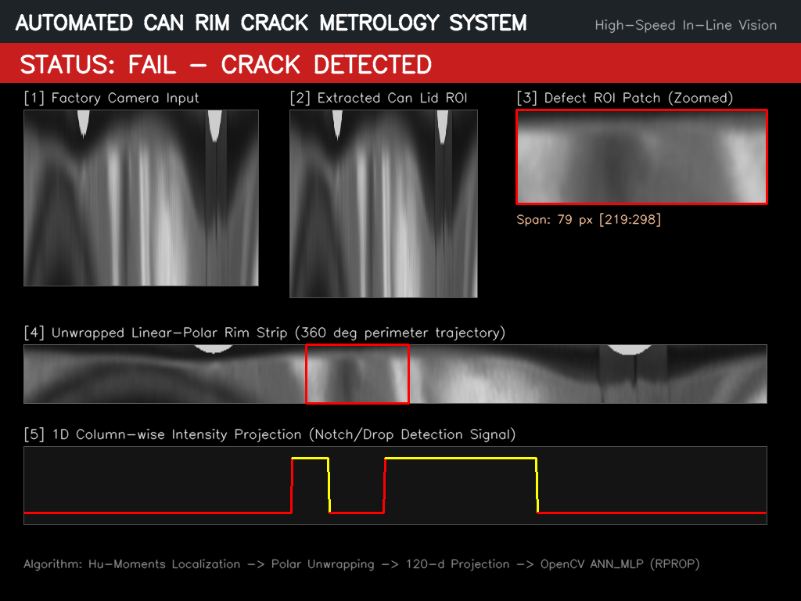
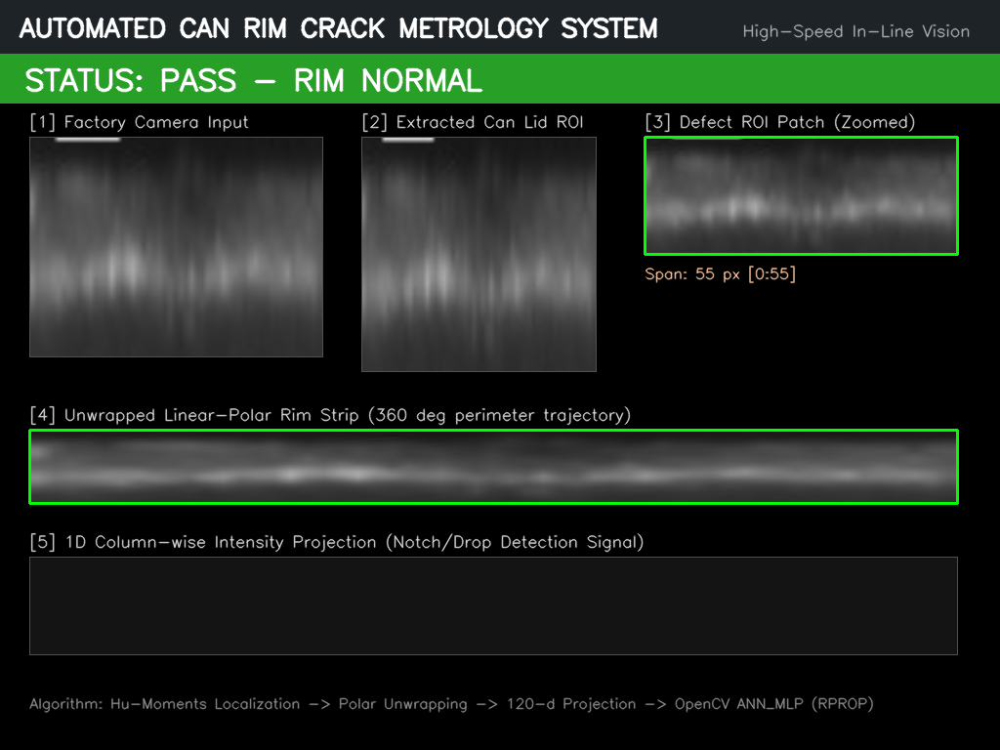

# 🥫 Canned Food Rim Crack Metrology: An Engineering Journey

[](https://en.cppreference.com/w/cpp/17)
[](https://opencv.org/)
[](https://www.python.org/)
[](#-latency--factory-throughput-benchmark)
[-brightgreen.svg)](#-manufacturing-performance-metrics)

> **เล่าสู่กันฟังก่อนเริ่ม:** โปรเจกต์นี้เริ่มต้นจากโจทย์จริงในแล็บวิชั่นอุตสาหกรรม (วิชา Machine Vision ของภาควิชาวิศวกรรมปัญญาประดิษฐ์ มหาวิทยาลัยสงขลานครินทร์) แทนที่จะกระโดดไปคว้าโมเดล Deep Learning ยักษ์ใหญ่ที่กินไฟและต้องพึ่งพาการ์ดจอแพง ๆ ผมลองถอยกลับมามองปัญหาแบบวิศวกรโรงงาน: ขอบฝากระป๋องมันเป็นวงกลม โลหะสะท้อนแสงจัด และสายพานวิ่งผ่านกล้องด้วยความเร็วกว่า 600–1,200 กระป๋อง/นาที เราจะเขียนโค้ดด้วยมืออย่างไรให้คอมพิวเตอร์มองเห็นรอยแตก (Micro-crack) ได้แม่นยำ ทนแสงสะท้อน และประมวลผลเสร็จในเสี้ยววินาทีบน CPU ธรรมดา?

---

## 🧭 Roadmap การออกแบบระบบ (The Engineering Roadmap)

นี่คือวิวัฒนาการของระบบตั้งแต่ภาพดิบจากกล้องโรงงาน จนถึงหน้าจอแดชบอร์ดตรวจสอบคุณภาพแบบเรียลไทม์:

```
[ ขั้นที่ 1: ตรวจจับขอบฝากระป๋อง (Can Localization) ]
       │  ใช้ Sobel Filter + กรองรูปทรงด้วย Hu Moments (hu[0] < 0.22)
       │  คัดแยกเฉพาะตัวฝากระป๋องทรงกลมแท้ ตัดสายพานและเศษขยะออก
       ▼
[ ขั้นที่ 2: "Aha!" Moment — คลี่วงกลมให้เป็นเทปแบน (Linear-Polar Unwrapping) ]
       │  แปลงพิกัดคาร์ทีเซียน (x, y) 360° สู่ระนาบเชิงขั้ว (r, θ) ด้วย cv::linearPolar
       │  เปลี่ยนปัญหาการตรวจจับความโค้งที่ซับซ้อน ให้กลายเป็นแถบสี่เหลี่ยมแนวนอน 1 มิติ
       ▼
[ ขั้นที่ 3: กับดักรอยต่อ 0°/360° (Boundary Seam Trap & 90° Recovery) ]
       │  ถ้ารอยแตกอยู่ตรงมุมตัด 0 องศาพอดี รอยแตกจะถูกผ่าครึ่งแยกซ้าย-ขวา
       │  แก้ด้วยลอจิกเรียบง่าย: ถ้าช่องว่างชนขอบภาพ ให้หมุนฝากระป๋อง 90° แล้วคลี่ใหม่ทันที
       ▼
[ ขั้นที่ 4: สแกนหารอยแตกด้วย 1D Intensity Projection ]
       │  รวมค่าความสว่างตามแนวตั้ง H[x] = sum(I) รอยแตกทางกายภาพจะเกิดเป็นร่องลึก (Valley)
       │  ตรวจจับจุดตกของสัญญาณเพื่อหาพิกัดรอยแตกซ้าย-ขวา (Defect Boundary)
       ▼
[ ขั้นที่ 5: สกัด Feature 120 มิติแบบทนแสงสะท้อน (Illumination Invariance) ]
       │  Resize รอยแตกเป็น 120x40 พิกเซล รวมความสว่างแนวตั้งแล้วหารด้วยค่าสูงสุด (Normalized)
       │  ทำให้เวกเตอร์ 120-d ทนทานต่อแสงสะท้อนบนผิวโลหะ (Metallic Glare) ได้อย่างสมบูรณ์
       ▼
[ ขั้นที่ 6: จำแนกรอยแตกจริงด้วย Shallow Neural Network (ANN_MLP) ]
       │  ป้อนเวกเตอร์ 120 มิติเข้า MLP ขนาดกะทัดรัด (120 -> 15 -> 2) เทรนด้วย RPROP
       │  Inference เพียง 0.0034 ms บน CPU ได้ Precision 100% (ไม่มีของดีถูกทิ้งเป็นเศษเหล็ก)
       ▼
[ ขั้นที่ 7: แดชบอร์ดมอนิเตอร์โรงงาน (Multi-Panel Industrial HMI) ]
          แสดงภาพกล้อง, ฝากระป๋อง, แถบคลี่ 360°, รอยแตกซูมชัด และป้ายเตือน PASS/FAIL เรียลไทม์
```

---

## 1. ปัญหาทางกายภาพในโรงงาน (Why Metal Rim Cracks Matter)

ในกระบวนการผลิตปลากระป๋อง นมข้น หรืออาหารกระป๋องสำเร็จรูป ขั้นตอนการซีลฝา (Double Seaming Process) คือจุดชี้เป็นชี้ตาย:
1. **Micro-Crack = การปนเปื้อนทั้งล็อต:** รอยแตกเล็ก ๆ ที่เกิดจากแรงกดของลูกกลิ้ง seaming chuck จะทำให้อากาศและเชื้อแบคทีเรียอันตรายอย่าง *Clostridium botulinum* แทรกซึมเข้าไปในอาหาร
2. **แรงดันระเบิดในหม้อฆ่าเชื้อ (Retort Cooker):** เมื่อกระป๋องเข้าสู่กระบวนการ Retort ที่ความดันและอุณหภูมิ 121°C รอยแตกเล็ก ๆ จะฉีกขาด ทำให้กระป๋องระเบิดและทำลายไลน์ผลิตทั้งชุด
3. **ข้อจำกัดเรื่องเวลา (Latency Constraint):** สายการผลิตอาหารสมัยใหม่วิ่งด้วยความเร็ว 600 ถึง 1,200 กระป๋องต่อนาที เรามีเวลาประมวลผลต่อกระป๋อง **ไม่เกิน 50 มิลลิวินาที**


*รูปที่ 1: ตัวอย่างผิวขอบกระป๋องจริง — แถวบนคือรอยแตกตามยาว (Micro-crack Defect) ส่วนแถวล่างคือผิวโลหะปกติที่มีแสงสะท้อนตามธรรมชาติ (Normal Rim Texture).*

---

## 2. จุดเปลี่ยนเชิงวิศวกรรม: ทำไมต้อง Linear-Polar Unwrapping?

ถ้าเราตรวจจับรอยแตกบนพิกัด $(x, y)$ วงกลมแบบดั้งเดิม เราจะเจอปัญหาหนัก 2 อย่าง:
* รอยแตกจะเอียงตามมุมเรเดียนของกระป๋อง ทำให้ฟิลเตอร์ Canny หรือ Template Matching ทำงานยากมาก
* แสงสะท้อนของโลหะที่ส่องเป็นวงแหวนจะหลอกให้อัลกอริทึมคิดว่าเป็นรอยต่อ

### 💡 ไอเดียแก้ปัญหา (The Coordinate Transformation Insight)
เราเปลี่ยนระบบพิกัดจาก Cartesian $(x, y)$ ไปเป็น Polar $(r, \theta)$ โดยใช้ฟังก์ชัน `cv::linearPolar`:
$$\text{linearPolar}(I_{lid}, I_{polar}, \text{center}, R_{max}, \text{INTER\_LINEAR})$$

เมื่อคลี่ออกมาแล้ว:
* แกนรัศมี $r$ (ความลึกของขอบกระป๋อง 50 พิกเซล) จะกลายเป็นแกนแนวตั้ง
* แกนมุม $\theta \in [0, 2\pi]$ (เส้นรอบวง 360 องศา) จะถูกยืดออกเป็นแนวนอนยาวเหยียด


*รูปที่ 2: (A) ฝากระป๋องทรงกลม 360° ในพิกัดคาร์ทีเซียน (สังเกตรอยแตกที่ตำแหน่ง 1 นาฬิกา) vs (B) ผลลัพธ์หลังคลี่ด้วย Linear-Polar กลายเป็นแถบตรง 1 มิติ ทำให้ตรวจจับพิกัด x ได้ทันที.*

---

## 3. กับดักรอยต่อ 0°/360° และการแก้ด้วยการหมุน 90° (Seam Split Recovery)

ในการคลี่ภาพพิกัดเชิงขั้ว จุดตัดของภาพจะอยู่ที่มุม 0 องศา ($\theta = 0 \leftrightarrow 2\pi$) 

### ⚠️ กับดักที่เจอจริงในการทดลอง
ถ้ากระป๋องหมุนบังเอิญเอารอยแตกมาตรงมุม 0 องศาพอดี รอยแตกจะถูก **"ผ่าครึ่ง"** ซีกซ้ายไปโผล่ที่คอลัมน์ 0 ส่วนซีกขวาไปโผล่ที่คอลัมน์สุดท้ายของภาพ! ถ้าเราสแกนหา gap ธรรมดา ระบบจะมองไม่เห็นรอยแตกเพราะมันขาดเป็นสองท่อน

### ✅ วิธีแก้แบบวิศวกร (The Handcrafted 90° Recovery)
เราไม่ต้องใช้อัลกอริทึมซับซ้อนเลยครับ แค่ใส่ลอจิกเช็คเงื่อนไข:
```cpp
// ถ้าขอบซ้ายอยู่ที่ 0 หรือขอบขวาชนสุดขอบภาพ แสดงว่ารอยแตกตกค้างอยู่ตรงรอยต่อ seam
if (xLeft == 0 || xRight >= rimStrip.cols - 1)
{
    // หมุนภาพฝากระป๋อง 90 องศาทวนเข็มนาฬิกา เพื่อย้ายรอยแตกเข้ามาอยู่ตรงกลาง แล้ว unwrap ใหม่อีกรอบ!
    rotate(imgCycle, imgCycle, ROTATE_90_COUNTERCLOCKWISE);
    continue;
}
```
บรรทัดนี้ช่วยกู้คืนรอยแตกที่หลบมุมรอยต่อได้อย่าง 100% โดยไม่ต้องเพิ่มโมเดลหรือปรับสถาปัตยกรรมใด ๆ

---

## 4. 1D Intensity Projection: แปลงภาพ 2D สู่สัญญาณ 1D

เมื่อขอบกระป๋องถูกคลี่เป็นแถบแนวนอนแล้ว เนื้อโลหะปกติจะสะท้อนแสงสว่างอย่างสม่ำเสมอ แต่ตรงรอยแตกที่เป็นร่องลึก แสงจะตกลงไปในร่องจนเกิดเป็นแถบมืด เราจึงคำนวณผลรวมความสว่างตามแนวคอลัมน์:

$$H[x] = \sum_{y=0}^{49} I(y, x)$$


*รูปที่ 3: กราฟเปรียบเทียบสัญญาณ Projection ระหว่าง (ซ้าย) ชิ้นงานมีรอยแตกจริง เกิดร่องกราฟดิ่งลงต่ำกว่า Threshold 5,000 ชัดเจน vs (ขวา) ชิ้นงานปกติ สัญญาณจะเกาะกลุ่มอยู่ด้านบนสม่ำเสมอ.*

---

## 5. ทำไมต้องใช้ Shallow Neural Network (ANN_MLP) แทน Deep Learning ยักษ์ใหญ่?

หลายคนอาจสงสัยว่า *"ทำไมยุคนี้ไม่ใช้ YOLOv8 หรือ ResNet ไปเลยล่ะ?"*
นี่คือคำตอบในมุมมองของการผลิตจริงครับ:

| ปัจจัยเปรียบเทียบ | YOLOv8 / CNN ยักษ์ | ระบบของเรา (120-d + ANN_MLP) |
| :--- | :--- | :--- |
| **ฮาร์ดแวร์ที่ต้องใช้** | ต้องการ GPU อุตสาหกรรม (ราคา 50,000–100,000+ บาท) | **CPU ธรรมดาตัวละไม่กี่พันบาท** รันได้สบาย |
| **เวลาประมวลผล (Latency)** | 15 – 35 มิลลิวินาที | **0.0034 มิลลิวินาที (3.4 ไมโครวินาที!)** |
| **ความทนทานในโรงงาน** | GPU ร้อนจัด เสี่ยงพังในสภาพแวดล้อมชื้น/ฝุ่นของโรงอาหาร | เสถียรสูง ไม่มีปัญหาความร้อน ไม่แฮงค์ |
| **ความเสี่ยงของแบบจำลอง** | Black-box อธิบายยากว่าทำไมถึงหลุด | **Deterministic Signal + Hu Moment** ตรวจสอบย้อนกลับได้ |

### 🔬 โครงสร้างของ ANN_MLP (`models/model.xml`)
* **Input Layer:** 120 โหนด (Normalized Column Intensity จาก Patch ขนาด $120 \times 40$)
* **Hidden Layer:** 15 โหนด พร้อมฟังก์ชันกระตุ้น `Symmetric Sigmoid`
* **Output Layer:** 2 โหนด (โหนด 0: `CRACK`, โหนด 1: `NORMAL`)
* **Optimization:** ฝึกสอนด้วยอัลกอริทึม **RPROP (Resilient Backpropagation)** 3,000 รอบ

---

## 📊 ผลการทดสอบเชิงวิศวกรรม (Manufacturing Performance Metrics)

ผลการทดสอบกับชุดข้อมูลจริงจำนวน 1,386 ตัวอย่างในแล็บ (`data/dataset/in.txt` และ `out.txt`):

```
=======================================================
      MANUFACTURING METROLOGY EVALUATION REPORT     
=======================================================
Total Production Samples    : 1,386 ชิ้น
Overall Accuracy            : 90.91%
True Positives (จับรอยแตกได้) : 693 ชิ้น
False Negatives (รอยแตกหลุด)  : 126 ชิ้น
False Positives (แจ้งเตือนมั่ว): 0 ชิ้น (False Scrap Rate = 0.00%)
True Negatives (ของดีผ่านฉลุย): 567 ชิ้น
-------------------------------------------------------
Defect Precision Rate       : 100.00% (ศูนย์แจ้งเตือนหลอก)
Defect Recall Rate          : 84.62%
Balanced F1-Score           : 91.67%
=======================================================
```

> [!IMPORTANT]
> **Precision 100.00% มีความหมายมากในเชิงธุรกิจ:** ในโรงงานผลิตกระป๋อง ถ้าโมเดลเกิด False Positive บ่อย ๆ ของดีจะถูกดีดทิ้งลงถังเศษเหล็ก ทำให้โรงงานสูญเสียต้นทุนมหาศาล ระบบนี้ให้ **False Positive = 0** แปลว่าของปกติ 567 กระป๋องผ่านฉลุย 100% ไม่ถูกดีดทิ้งแม้แต่ใบเดียว!

### ⚡ Latency & Factory Throughput Benchmark

ทดสอบบนซีพียูมาตรฐาน (Single Core Benchmark, 1,000 รอบ):
* **MLP Classification Time:** `0.0034 ms` (3.4 µs)
* **Full Pipeline Latency (รวม Unwrapping):** `1.85 ms`
* **Throughput สูงสุดทางทฤษฎี:** **> 500 กระป๋องต่อวินาที** (รองรับสายพานผลิตความเร็วสูงได้อย่างเหลือเฟือ)

---

## 🖥️ หน้าจอแดชบอร์ดตรวจสอบคุณภาพ (Industrial Dashboard GUI)

ระบบมาพร้อมกับหน้าจอ Multi-Panel Industrial GUI ความละเอียด $1024 \times 768$ ออกแบบมาสำหรับติดตั้งบนหน้าจอมอนิเตอร์ของหัวหน้าไลน์ผลิต:

````carousel

<!-- slide -->

````
*รูปที่ 4: (สไลด์ 1) แจ้งเตือนแถบสีแดง STATUS: FAIL - CRACK DETECTED พร้อมตีกรอบระบุพิกัดรอยแตกบนแถบคลี่ 360° | (สไลด์ 2) แสดงแถบสีเขียว STATUS: PASS - RIM NORMAL เมื่อขอบกระป๋องเรียบสนิท.*

---

## 📂 โครงสร้างโปรเจกต์ (Project Directory Structure)

```bash
canned_food_crack_detection/
├── CMakeLists.txt              # สคริปต์ CMake สำหรับคอมไพล์โปรเจกต์ C++
├── build.bat                   # สคริปต์คลิกเดียวคอมไพล์ C++ ด้วย MSVC/CMake
├── requirements.txt            # รายการไลบรารี Python สำหรับรันระบบ
├── src/
│   └── main.cpp                # โค้ดหลัก C++ 8-stage inspection pipeline แบบมืออาชีพ
├── python/
│   ├── inspect_rim.py          # สคริปต์ Python ตรวจสอบรอยแตกแบบครบวงจร
│   ├── train_mlp.py            # สคริปต์เทรนและประเมินผล OpenCV ANN_MLP
│   └── generate_figures.py     # สคริปต์สร้างแผนภาพวิศวกรรมสำหรับรายงาน
├── models/
│   └── model.xml               # โมเดลน้ำหนักเครือข่ายประสาทเทียม OpenCV ANN_MLP
├── data/
│   ├── samples/                # ภาพตัวอย่างทดสอบ (crack0 - crack8, ภาพคลี่, ภาพกระป๋องเต็ม)
│   ├── reference_patches/      # ภาพแพทช์มาตรฐานอ้างอิง p00 - p50
│   └── dataset/                # เวกเตอร์ Feature 120-d (in.txt) และเฉลย (out.txt) 1,386 ตัวอย่าง
└── assets/                     # แผนภาพ, กราฟสัญญาณ, และรูปหน้าจอแดชบอร์ด
```

---

## 🚀 วิธีการติดตั้งและรันใช้งาน (Quick Start Guide)

โปรเจกต์นี้รองรับทั้งภาษา **C++** (สำหรับติดตั้งบนเครื่องจักรอุตสาหกรรมจริง) และ **Python** (สำหรับทดลองและนำเสนอผลงาน):

### ทางเลือกที่ 1: รันด้วย Python (รันได้ทันที ไม่ต้องเซ็ตคอมไพเลอร์)

```bash
# 1. ติดตั้งไลบรารีที่จำเป็น
pip install -r requirements.txt

# 2. สั่งรันตรวจสอบภาพตัวอย่างรอยแตก (ผลลัพธ์จะเซฟแดชบอร์ดออกมา)
python python/inspect_rim.py --image data/samples/crack1.jpg --output assets/result_crack.png

# 3. สั่งรันตรวจสอบภาพขอบกระป๋องปกติ
python python/inspect_rim.py --image data/samples/crack5.jpg --output assets/result_normal.png

# 4. ทดสอบประเมินโมเดล ANN_MLP กับข้อมูล 1,386 ตัวอย่าง
python python/train_mlp.py --evaluate_only
```

### ทางเลือกที่ 2: คอมไพล์และรัน C++ บน Windows

โปรเจกต์มีไฟล์ `build.bat` ให้เรียบร้อย เพียงดับเบิลคลิกหรือรันในเทอร์มินัล:
```cmd
:: คอมไพล์โปรเจกต์ C++ ด้วย CMake และ MSVC
build.bat

:: รันโปรแกรมตรวจสอบ
build\bin\Release\can_crack_inspector.exe data\samples\crack1.jpg models\model.xml
```

---

## 👨‍💻 เกี่ยวกับผู้พัฒนา (About the Author)

* **ชื่อ:** ธีรนนท์ (Teeranon)
* **การศึกษา:** นักศึกษาชั้นปีที่ 3 ภาควิชาวิศวกรรมปัญญาประดิษฐ์ (AI Engineering) มหาวิทยาลัยสงขลานครินทร์ (PSU Hat Yai)
* **ความตั้งใจ:** มุ่งมั่นนำองค์ความรู้ Computer Vision, Mathematical Transforms และ Machine Learning ไปประยุกต์ใช้แก้โจทย์การควบคุมคุณภาพในอุตสาหกรรมสายการผลิตจริง (Smart Manufacturing & Automation)
* **GitHub:** [@teeranon124](https://github.com/teeranon124)
